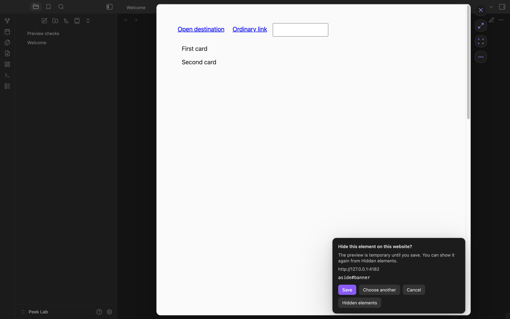

# Link Float

Open a live webpage over your note or Web viewer tab, then close it or keep it as an Obsidian tab. Hold **Shift** and click a web link in Reading view, Live Preview, or an ordinary Web viewer tab. Your Markdown stays unchanged.



## Requirements and installation

Requires **Obsidian 1.13.7 or later on desktop**, a recent Obsidian installer, and the **Web viewer** core plugin. Tested on macOS. Mobile is not supported; Windows and Linux interface behavior has not been verified.

For manual installation:

1. Download `main.js`, `manifest.json`, and `styles.css` from a [GitHub release](https://github.com/igorhajduk/obsidian-link-float/releases).
2. Put them in your vault's `.obsidian/plugins/link-float/` directory.
3. Enable **Web viewer** in Core plugins and **Link Float** in Community plugins.

When updating, replace those three files and retain any existing `data.json` settings file.

## Using previews

- **Open:** hold Shift and click an HTTP(S) link. Change the modifier in **Settings → Link Float** to Alt/Option, Control, or Command/Windows.
- **Close:** click ×, click outside the page, or use Cmd/Ctrl+W. With focus inside the webpage, the first Escape moves focus to the controls; the next closes the preview.
- **Keep:** the expand button turns the same live page into an ordinary Obsidian tab. Its form state, history, and scroll position remain intact.
- **Search:** Cmd/Ctrl+F searches the webpage. Enter advances to the next match; Escape closes search first.
- **Hide elements:** the selection button between Keep and ⋯ starts the element picker.
- **More:** the ⋯ menu provides back, forward, reload, copy address, **Hidden elements**, and **Keep open on outside click**.

The page expands from the clicked link and closes with the reverse movement. Its size follows the space between the sidebars. Reduced-motion preferences are respected.

The command palette also provides **Open URL in preview**, **Preview link at caret**, **Close preview**, and **Keep preview as tab**.

## Hiding page elements

Choose **Hide elements**, point at an element, and click to preview hiding it. **Save** applies the rule to this website across its pages, reloads, and later openings. **Cancel** or Escape discards the preview. Close and Keep also discard an unsaved selection.

Saved rules apply automatically in previews and ordinary Web viewer tabs, including tabs opened independently or restored with the workspace. Changes apply to matching open tabs without reloading them. Websites are scoped by exact origin: scheme, hostname, and port; subdomains are separate.

Use **Hidden elements → Show again** to remove a saved rule. In an ordinary Web viewer tab, the command palette provides **Hide an element on this page** and **Manage hidden elements**. The manager lists rules for every saved website, including rules with no current match.

Rules hide page elements without removing their DOM nodes. If a selector matches multiple elements or the target no longer matches its saved characteristics, hiding pauses for that rule. Rules with no match remain saved. The manager shows the current page's status. This version selects elements in the top document; iframe contents and Shadow DOM internals are not traversed, though their outer containers can be selected.

## Closing and reading positions

When a website requests a close warning, **Leave / Cancel** appears. Cancel keeps the same page and its unsaved content. Closing an ordinary page or choosing Leave discards its live form state. Keep the page as a tab if you want to continue editing it later. A website may save and restore drafts through its own storage.

Reopening a link can restore its document scroll position. Explicit section links take priority, and scrolling manually stops delayed restoration. Disable **Remember reading position** or use **Clear positions** in settings at any time. Pages with nested scrolling regions or their own scroll management may behave differently.

## Website sessions and privacy

Webpages load directly through Obsidian's Web viewer. Their servers receive the requested URLs and ordinary browser requests; there is no Link Float proxy or analytics service. Link Float requires no account, though individual websites may require sign-in.

Sessions belong to the vault's core Web viewer storage. Closing a preview does not sign you out. Link Float does not import cookies from other browsers or store passwords in your notes. Other Obsidian plugins can access Web viewer cookies under [Obsidian's plugin security model](https://obsidian.md/help/plugins/web-viewer).

Saved reading positions contain complete page URLs, scroll coordinates, and timestamps for up to 100 URLs over 30 days. They use Obsidian's local storage for this vault on this device. Plugin preferences and up to 500 hiding rules use `data.json`, which may be included by your sync setup. Hiding rules retain the website origin, CSS selector, target tag/ID/classes, a text fingerprint where needed, and creation time; they have no automatic expiry. Note contents, form values, full page DOM, and browsing history are not saved by Link Float. A temporary page image used while closing exists only in memory. **Copy page address** writes to the clipboard only when selected; the plugin does not read clipboard contents.

## Known limits

- GitHub sign-in works in the tested environment. Google sign-in returns a 401 error in both Link Float and an ordinary Web viewer tab. Google Docs authentication is not currently supported in that environment.
- Popup-based sign-in and other site-specific behavior depend on Web viewer. Redirects, downloads, permissions, certificates, and in-page navigation follow its behavior.
- Previews work in the main vault window. Pop-out windows are not supported.
- The integration uses private Web viewer APIs and may need adjustments after Obsidian updates.
- Temporary previews are omitted from saved workspace layouts. Keep a page as a tab to retain it in the workspace. Disabling the plugin removes its temporary preview.

## Development

```sh
npm ci
npm run package
```

The installable folder is `dist/link-float`. See [contributing](CONTRIBUTING.md), [architecture](docs/architecture.md), and [testing](docs/testing.md). Report reproducible problems through [GitHub Issues](https://github.com/igorhajduk/obsidian-link-float/issues).

Released under the [MIT license](LICENSE). The bundled CSS Selector Generator also uses the MIT license; its notice is included in `main.js`.
